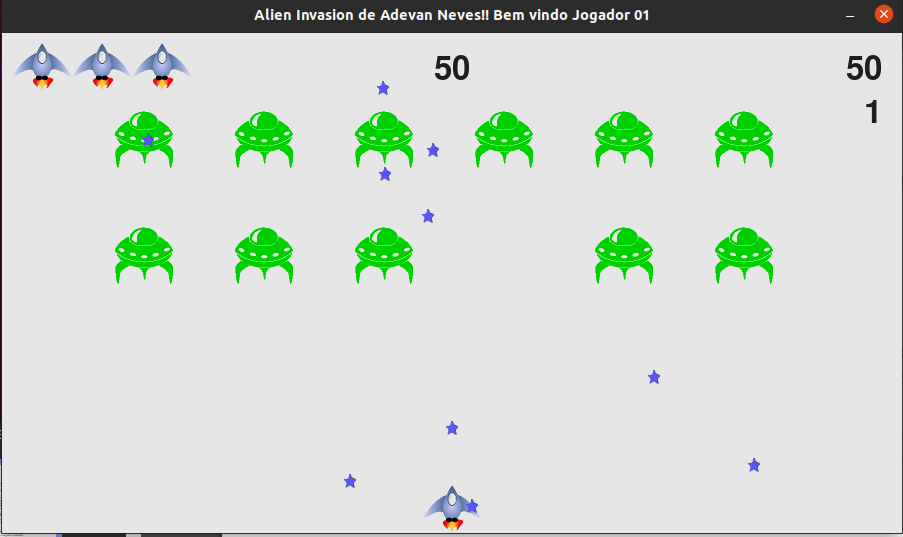
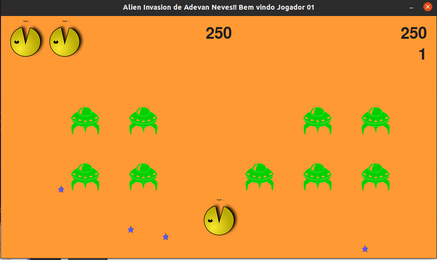

# Seja bem vindo ao Alien Invasion de Adevan Neves Santos.

[Linkedin](https://www.linkedin.com/in/adevan-neves-santos)
[Github](https://github.com/Adevan-Neves/)

## Descrição Breve deo projeto :video_game:

### Antes de iniciar o jogo, você tem a opção de personalizar a sua experiência com a execução do main.py, pois este arquivo fará o armazenamento em formato json de : nome de jogador, nome de personagem (pacman ou ship) e a cor de fundo na tela. Depois, você executará o arquivo alien_invasion.py para que o jogo inicie.
###  O jogador controla a personagem, podendo movê-la  para a direita ou esquerda com as teclas de direção do computador, assim como atirar no alvo utilizando a barra de espaço ou a tecla 3, dependendo de qual personagem utilize. Iniciando o jogo com o pressionamento da tecla "p", a personagem possui 3 "vidas" que serão perdidas por meio  de colisões com aliens ou passagem de aliens sobreviventes para a parte inferior da tela. Se o jogador derrubar toda a frota, aumenta seu level em 1 e o jogo aumenta de velocidade. 
### o Jogo possui dois personagens, o default chamado de ship (espaçonave) e o pacman, que possui todas as habilidades de ship mais a possibilidade de se movimentar verticalmente e atirar pela lateral direita.

#### Personagens e temas:




## Achou interessante ? Mas como você pode jogar ele ?


## 1 ) Instalação e preparação do ambiente


### 1.1  ) Preciso do python 3 ou superior instalado na máquina.
- [Tutorial de instalação Windows, Mac e Linux](https://youtu.be/VuKvR1J2LQE)

### 1.2 )  Instalação de gerenciador pip ou pip3
### Windows, Linux, MacOS :computer:
####  [Link](https://pip.pypa.io/en/stable/installation/)

### 1.3 ) Instalação da biblioteca Pygame
### Windows :computer:

```bash
pip install pygame
```
### Linux :computer:
```bash
pip3 install pygame
```
### 1.4 ) Clone do projeto GITHUB
```bash
git clone https://github.com/Adevan-Neves/Python-Invasion-e-Data-Visualization.git
```


## 2 ) Só quero jogar !!!!


### 2.1) Então você irá criar uma conta no site [ Replit ](https://replit.com/) e irá acessar meu projeto pelo seguinte [link](https://replit.com/@AdevanNeves/AlienInvasion#). Neste ambiente você poderá rodar o jogo no seu navegador web.
### 2.2) na plataforma , você irá executar o alien_invasion.py
### 2.3) Aviso !!!!! A jogabilidade pode ficar comprometida de acordo com a qualidade de sua internet.

### Funcionamento do jogo:

- Iniciar e Reiniciar : Pressione a tecla p.
- Atirar para cima : Pressione a tecla de espaço.
- Atirar para o lado direito (funcionalidade única do personagem pacman): Pressione a tecla 3.
- Sair da tela do jogo : Pressione a tecla q.
- Mover para direita e esquerda : teclas de direção direita e esquerda.
- Mover para cima e para baixo (funcionalidade única do personagem pacman) : teclas de direção cima e baixo.
- Mudar de personagem : vá ao arquivo.json, e mude o nome do personagem.

### Como rodar o jogo pelo terminal ?

#### É muito importante que você execute o alien_invasion.py a partir de diretório raiz do projeto, ou seja, do local onde está o diretório adevanAlienInvasion.

#### Comandos:

```bash
python3 adevanAlienInvasion/main.py
```

```bash
python3 adevanAlienInvasion/alien_invasion.py
```

## [Tutorial no youtube sobre o jogo](https://youtu.be/gUWD1UExjEA)